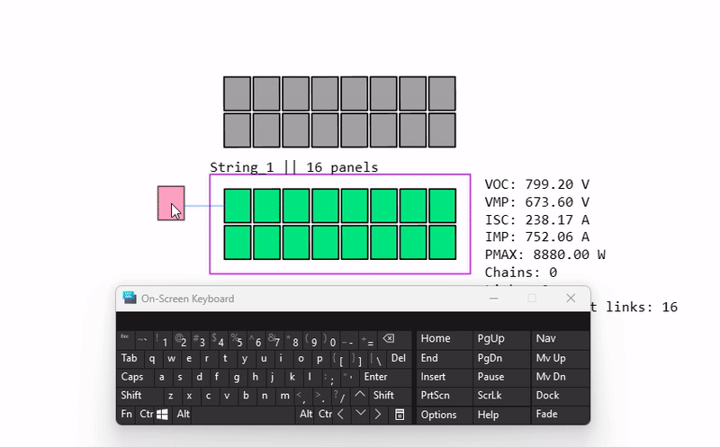

<h1 align="center">
   
  
</h1>

<h4 align="center">A web app for designing solar system installs built on top of <a href="https://angular.io/" target="_blank">Angular, NGRX, ASP.NET, SignalR</a>.</h4>

  <a href="#how-to-use">How To Use</a> •
  <a href="#key-features">Key Features</a> •
  <a href="#release-history">Release History</a> •
  <a href="#roadmap">Roadmap</a> •
  <a href="#credits">Credits</a> •
  <a href="#license">License</a>

[//]: # (
)

[//]: # ()

[//]: # (
)

## How To Use

Visit <a href="https://solarengineer.app/" target="_blank">SolarEngineer.App</a>

### Snapping to Axis
- Hold `Alt` to snap to axis of nearest panel

(<a href="#readme-top">back to top</a>)

### Multi Create Panels

- Press `M` to enter multi create mode
- Hold `Alt` and drag in create mode to multi create

### Multi Select Panels

- Ensure you are in select mode (press `M` to exit multi create mode)
- Hold `Alt` and drag to multi select panels
- When panels are selected, press `ESC` to deselect all panels

### Move Selected Panels

- Ensure you have panels selected (see above)
- Hold `Ctrl` and `Shift` and drag to move selected panels

### Rotate Selected Panels

- Ensure you have panels selected (see above)
- Hold `Ctrl` and `Alt` and drag to rotate selected panels

### Create String with Selected Panels

- Ensure you have panels selected (see above)
- Press `C` to create a string with selected panels
- Press `ESC` to deselect string

### Link Panels in Selected String

- Ensure you have a string selected (see above)
- Press `L` to enter link mode
- Click on a panel to start linking
- Click on another panel to finish linking
- Hold `Shift` when finishing a link to automatically start a new link
- Press `L` to exit link mode

  

### Delete Selected Panels

- Ensure you have panels selected (see above)
- Press `Delete` to delete selected panels

(<a href="#readme-top">back to top</a>)

## Key Features

### Projects
- Create, update, and delete projects
- View project details
- Change project name
- Change project colour
- Invite users to projects
- View project members
- View project strings in data view in side UI

### Strings
- Create, update, and delete strings
- View string details
- View string panels
- View string stats next to the selected string
- Link panels in link mode
- View links with line graphics
- Create a string with selected panels
- Change string colour
- Surrounding box for selected string
- Right click in selected string to open string context menu
  - View string details
  - View connecting Panel Links in String
  - Change String colour
  - Delete string

### Panels
- Click to create a panel
- Alt click drag to multi-select
- Alt click drag in create mode to multi-create
- Create a string with selected panels
- Move, rotate, and delete panels on desktop
- Right click to open panel context menu
  - View panel details
  - View connecting Panel Links
  - Move to existing String
  - Delete panel
- Surrounding box for selected panels
- Right click in selected panels to open panel context menu
  - Create string with selected panels
  - Move all panels to existing String
  - Delete all selected panels

### Panel Links
- Create Panel Links between panels in a string
- View Panel Links in a string in link mode
- View amount of vanel Links in a string in data view in side UI
- View amount of panels that are not linked in a string in data view in side UI
- Right click on panel link in link mode to open panel link context menu
  - View panel link details
  - View connecting panels
  - Delete panel link

### Authentication

- Sign in with Google
<!-- - Sign in with GitHub -->

### SignalR
- Real-time user updates
  - User status
  - User search
  - User project updates
  - User friend status updates
  - User notification updates
- Real-time project updates
  - Project updates
  - Project member updates
  - Project string updates
  - Project panel updates
  - Project panel link updates

### Users
- View user profile
- View user projects
- Search for users by username with real-time updates
- View user settings
- Friends
  - Send friend requests
  - Accept friend requests
  - Reject friend requests
  - View friends
  - View friend requests
  - Invite friends to projects
- Notifications
  - View notifications
  - Dismiss notifications
  - Delete notifications

### UI
- Responsive design
- Context menus for desktop
- Side UI for desktop
- Mobile
  - Mobile friendly
  - Fullscreen side UI
  - Optimised dialogs for small screens
  - Touch controls
  - Zoom in and out
  - Pan around

### Settings
- Change key bindings
- Toggle graphics settings
<!-- - Toggle dark mode -->

(<a href="#readme-top">back to top</a>)

## Release History

### [1.0.8] - 2023-07-02

**New Features:**
- Authenticated users can now choose a template when creating a project.
- Implementation of templates on the backend for authenticated users.
- UI changes for guest users, sign-in dialog replaced with initial-visit-sign-in-with-templates.
- Users can now see project templates before deciding to sign in.
- Added dialog warning that loading a template will override the existing project for demo users.
- Starter template selection dialog pops up when user logs in as a guest.
- Ability to load templates and update the app importing local json state saves.
- Addition of templates for starter projects; in demo account, project now saves to local storage and automatically loads on login.
- Creation of chat dialog for showing user messages and group chats.
- Message contracts ported to TypeScript in web-ui.
- Started messages-service for the backend.
- New dialog for user search in the side UI.
- Added Microsoft login.
- Users side UI filtered by last active. 
- Member permissions visible in selected project members tab.
- Members with roles of owner or admin can now edit member permissions.
- Users can leave projects.
- Project Admins can now kick members from projects.
- Project Admins can now change member permissions.
- Project Admins can now change member roles.
- Project Admins can now delete projects.
- All project member edits are now reflected in real-time.

**Changes:**
- Update of UI for guest users. Removed side ui and replaced with a dialog for auth and projects.
- Updated roadmap and changelog in README.md.

**Bug Fixes:**
- Fixed a bug where friend requests weren't being accepted due to Entity Framework tracking. Users now immediately see if a user is online after accepting a friend request.
- Fixed a couple of bugs related to the SkiaSharp library not working in deployment.
- Fixed an issue with screen breakpoints.
- Bug fix where sometimes friends weren't seen as online.

**Removed:**
- Removed GitHub login

### [1.0.7] - 22/06/2023

**New Features:**
- Redesigned the desktop toolbar to include all action buttons from the mobile version.
- Mobile users can now create panel links without any glitches.
- Introduced a new side action bar for mobile users.

**Bug Fixes:**
- Fixed a bug with panel link lines mapping to random panels.

### [1.0.6] - 21/06/2023
**New Features:**
- Redesigned context menus.
- Enabled mobile controls for moving panels, selecting, and multi-selecting.
- Moved the settings dialog to the side UI for mobile users.

**Bug Fixes:**
- Panel links are now saved to the database and can update in real-time over SignalR.
- Optimized large SignalR messages and put a limit on 30 max panels to be created at once. A message is displayed on the canvas when this limit is exceeded.
- Fixed an issue causing a failure in project creation when encountering an undefined string.

### [1.0.5] - 19/06/2023
**New Features:**
- Improved project management in the side UI, allowing users to edit projects on desktop and mobile.
- Implemented new user profile cards when tapping on the preview.
- Enhanced dialogs, side UI data view animations, and introduced SVG animations.
- Provided a different view for mobile in the projects side UI, now featuring a right-to-left animation for changing pages.
- Client now saves all friend connections and can see when users come online or go offline.
- Improved mobile UI for the side UI nav bar.
- Added custom dialogs for mobile screens.

**Bug Fixes:**
- Fixed the issue where an undefined string was not created on project creation.
- Sorted the projects list by last updated, updating the "last updated" field for every item create, update, or delete.
- Improved notifications for mobile devices.

### [1.0.4]- 14/06/2023
**New Features:**
- Added MessagePack to SignalR and included more options in the projects side menu.
- Enabled adding users to projects from the context menu. Built a reusable context menu component to streamline the process.
- Implemented the ability to invite friends to projects.
- Developed friend requests and notifications UI.
- Enabled accepting friend requests, viewing friends in the side menu, and improved notifications.
- Enabled sending friend requests and receiving notifications on the recipient side.
- Introduced notifications feature.
- Implemented search box querying for users and receiving responses via SignalR. Added a new users store.
- Added sign-in with GitHub.

**Bug Fixes:**
- Fixed the issue where an undefined string was not created on project creation.
- Redesigned Nginx proxy.

### [1.0.3] - 08/06/2023
**New Features:**
- Added effects for when other SignalR users make an action, updating both displays.

### [1.0.2] - 07/06/2023
**New Features:**
- Added SignalR for real-time updates between users.
- Added Google Sign in.

**API Changes:**
- Added a new `PanelLink` model to the API.

### [1.0.1] - 01/06/2023
**New Features:**
- Added Link mode when string is selected.
- New menu options.
- Change graphics settings for canvas.
- Able to edit keybindings for app.

### [1.0.0] - 20/05/2023
**New Features:**
- Create panels.
- Create strings.
- Switch between select and create mode.
- Multi create dragging in create mode.
- Multi select dragging in select mode.
- Zooming in and out.
- Dragging screen position.
- Moving panels.
- Rotating panels.
- Moving multiple panels while selected.
- Rotating multiple panels while selected.

(<a href="#readme-top">back to top</a>)

<!-- ROADMAP -->
## Roadmap

- [x] Add in multiple panel dragging and rotation
- [x] Add in settings menu
  - [x] Add change graphics settings
  - [x] Add edit keybindings
- [x] More strings edit functionality
  - [x] Open a dialog to display string settings
  - [x] Change string colour
  - [ ] Edit string name
- [x] More panels edit functionality
  - [ ] Edit panel config
  - [ ] Change panel data values that will change the total string stats
- [x] Implement backend for app
  - [x] Add auth
  - [x] Add save/load
  - [x] Add share projects with other users
  - [x] Multiple users on the same project at the same time via SignalR
- [x] Add in multiple auth providers
  - [x] Add Google Signin
  - [x] <del>Add Github Signin</del>
  - [x] Add in Microsoft Signin
- [x] Add SignalR
  - [x] Add in real-time updates for projects
  - [x] Add in real-time updates for users
  - [x] Add in real-time updates for strings
  - [x] Add in real-time updates for panels
  - [x] Add in real-time updates for panel links
  - [x] Add in real-time updates for project members
  - [x] Add in real-time updates for project invites
  - [x] Add in real-time updates for user notifications
  - [x] Add in real-time updates for user friend requests
  - [x] Add in real-time updates for user status
  - [x] Add in real-time updates for user search
  - [ ] Add in real-time updates for other user mouse cursors
  - [ ] Add in real-time updates for other user selections
  - [ ] Add in real-time updates for other user panel movements
  - [ ] Add in real-time updates for other user panel rotations
- [x] Invite users to project
  - [x] View project invites in side UI
  - [x] View project members in side UI
  - [x] As an admin, be able to remove users from the project
  - [x] Change roles of users in the project
  - [ ] Implement roles for users in the project
- [x] Edit project details
  - [x] Change project name
  - [x] Change project colour
  - [ ] Change project description
  - [ ] Change project tags
  - [ ] Change project visibility
  - [ ] Change project permissions
  - [ ] Change project roles
  - [ ] Change project owner
- [x] Add in UI for mobile
  - [x] Add all actions in mobile menu for doing everything you can do with a mouse and keyboard
  - [x] Optimise UI for mobile
  - [x] Add in mobile controls for moving, selecting, and multi-selecting panels
  - [x] Add in mobile controls for creating panel links
  - [x] Add in mobile controls for creating strings
  - [x] Add in mobile controls for creating panels
  - [x] Add in mobile action bar for doing actions on selected panels and strings
  - [ ] Add in mobile controls for editing panels
  - [ ] Add in mobile controls for rotating panels
- [x] Add in Connections
  - [x] Add in user profiles
  - [x] Add in user friend requests
  - [x] Add in user notifications
  - [x] Add in user settings
  - [x] Add in user search
- [ ] Add in Dark Mode
- [ ] Add in more graphics settings
- [ ] Add in more keybindings
- [ ] Add in Azure Maps
  - [ ] Be able to type in an address and have it search for it
  - [ ] Be able to save the location and take a screenshot of the map
  - [ ] Save the screenshot to the user's project and be able to view it inside the app
- [ ] Add in more panel types

(<a href="#readme-top">back to top</a>)

## Credits

This software uses the following open source packages:

- [Angular](https://angular.io/)
- [Nx](https://nx.dev/)
- [Ngrx](https://ngrx.io/)
- [Tailwind](https://tailwindcss.com/)
- [ASP.NET](https://github.com/dotnet/aspnetcore)
- [SignalR](https://github.com/SignalR/SignalR)
- [FastEndpoints](https://github.com/FastEndpoints/FastEndpoints)
<!-- - [![Angular][Angular.io]][Angular-url] -->

(<a href="#readme-top">back to top</a>)

## License

Distributed under the Apache License. See LICENSE for more information.

(<a href="#readme-top">back to top</a>)

---

> [solarengineer.app](https://solarengineer.app) &nbsp;&middot;&nbsp;
> GitHub [@hazzajenko](https://github.com/Hazzajenko) &nbsp;&middot;&nbsp;

[contributors-shield]: https://img.shields.io/github/contributors/hazzajenko/solar-engineer.svg?style=for-the-badge
[contributors-url]: https://github.com/hazzajenko/solar-engineer/graphs/contributors
[forks-shield]: https://img.shields.io/github/forks/hazzajenko/solar-engineer.svg?style=for-the-badge
[forks-url]: https://github.com/hazzajenko/solar-engineer/network/members
[stars-shield]: https://img.shields.io/github/stars/hazzajenko/solar-engineer.svg?style=for-the-badge
[stars-url]: https://github.com/hazzajenko/solar-engineer/stargazers
[issues-shield]: https://img.shields.io/github/issues/hazzajenko/solar-engineer.svg?style=for-the-badge
[issues-url]: https://github.com/hazzajenko/solar-engineer/issues
[license-shield]: https://img.shields.io/github/license/hazzajenko/solar-engineer.svg?style=for-the-badge
[license-url]: https://github.com/hazzajenko/solar-engineer/blob/master/LICENSE.txt
[Angular.io]: https://img.shields.io/badge/Angular-DD0031?style=for-the-badge&logo=angular&logoColor=white
[Angular-url]: https://angular.io/
